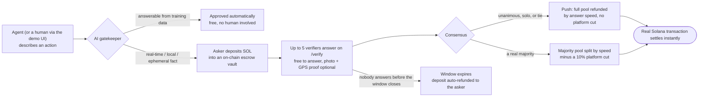

<p align="center">
  
</p>

<p align="center">
  <strong>Before an AI agent spends your money, a real human checks first.</strong>
</p>

<p align="center">
  <a href="https://trustact.manjom.works"></a>
  
  
  
</p>

<p align="center">
  Real questions, real people, real (test) money — settled on Solana. No token, no NFTs.
</p>

---

## Contents

- [What is this](#what-is-this)
- [How it works](#how-it-works)
- [Try it](#try-it)
- [Public API — for agents](#public-api--for-agents)
- [Tech stack](#tech-stack)
- [Local setup](#local-setup)
- [Environment variables](#environment-variables)
- [Status & limitations](#status--limitations)
- [Roadmap](#roadmap)
- [Credits](#credits)

## What is this

Autonomous AI agents (shopping, booking, concierge bots) act on what they
_know_ — not on what's actually true right now. "Is this restaurant open?"
"Is this item still in stock?" are real-time, local, ephemeral facts no
model can know from training data alone.

Trustact is a confidence check: before an agent commits real money, it asks
a real person first, backed by a real stake. Settlement happens
automatically on Solana, with no manual invoicing step and no self-judging
by the person who asked.

## How it works



1. **Ask** — describe an action. An AI gatekeeper decides whether it needs a
   human: only real-time, local, ephemeral facts get escalated — general
   knowledge is answered for free, with no human involved.
2. **Verify** — if escalated, up to 5 connected-wallet verifiers see the
   question on `/verify` and answer for free, optionally backed by a _live_
   camera capture and/or GPS location (never a file upload — proof has to be
   taken right now, not pulled from a saved photo). The asker picks how long
   the window stays open when they ask: 10 minutes, 1 day, or 10 days.
3. **Settle** — answers resolve by consensus, automatically, with nobody
   judging their own round. Unanimous, tie, or solo is a push (stake
   returned by speed, no platform cut). A real majority redistributes the
   pool, minus a 10% platform cut. If the window closes with zero answers,
   the asker's deposit is refunded automatically — nothing is ever
   permanently stuck in the vault.
4. **Pay** — a real Solana transaction settles the payout or refund.
   Correct answers build a public reputation score and a visible tier
   badge — nothing tradable, nothing to speculate on.

Everyone signs in with **Sign-In With Solana** (connect a wallet, sign a
free message proving ownership) — no passwords, no separate accounts.
Verifiers can optionally opt an email in to get notified when a new
question opens.

## Try it

The live site runs on **Solana devnet** — everything is real (real
transactions, real consensus, real payouts) except that the SOL itself is
test-network currency with no value. Nothing here costs real money.

<details>
<summary><strong>Getting started as a first-time visitor</strong></summary>

1. Open [trustact.manjom.works](https://trustact.manjom.works) and connect
   any Solana wallet (Phantom, Solflare, Backpack, Coinbase Wallet, Trust —
   or anything else that supports the Wallet Standard). Don't have one?
   [Phantom](https://phantom.app/download) takes under a minute to install.
2. Make sure your wallet is set to **devnet**, not mainnet.
3. If your wallet balance shows 0, a "Request Airdrop" prompt appears
   automatically — that's free devnet SOL, no card required. (The public
   faucet is sometimes rate-limited; [faucet.solana.com](https://faucet.solana.com/)
   is a fallback.)
4. **Ask** something real-time and local from the home page, or **answer**
   an open question on [`/verify`](https://trustact.manjom.works/verify) —
   answering is always free, no deposit needed.
5. Check `/verify`'s "Your history" and "Recent activity" sections to see
   past questions, answers, and payouts — including everyone else's.

</details>

## Public API — for agents

Headless agents can integrate directly without the UI:

```
POST /api/agent-action
Authorization: Bearer <AGENT_API_KEY>
Content-Type: application/json

{ "agentId": "my-shopping-agent", "action": "Book a table for 2 tonight — confirm the restaurant is actually open first." }
```

Returns either an immediate approval,

```json
{ "status": "approved", "confidence": 0.9, "reasoning": "..." }
```

or a round to poll:

```json
{
  "status": "pending_verification",
  "requestId": "...",
  "verificationQuestion": "...",
  "statusUrl": "/api/agent-action/status?requestId=..."
}
```

`GET` the `statusUrl` (same bearer token) until it resolves to `approved`,
`declined`, or `expired`. See
[`src/app/api/agent-action/route.ts`](src/app/api/agent-action/route.ts).

## Tech stack

| Layer       | What's used                                                                                                                                                                                                                                                        |
| ----------- | ------------------------------------------------------------------------------------------------------------------------------------------------------------------------------------------------------------------------------------------------------------------ |
| Framework   | **Next.js 16** (App Router) + TypeScript, **Tailwind CSS v4** + shadcn/ui                                                                                                                                                                                          |
| On-chain    | **Anchor** escrow program (`anchor/`) — real deposit / payout / refund instructions on Solana devnet, not decorative. **@solana/web3.js** + wallet-adapter power a custom connect modal with mobile universal links for wallets with no browser-extension presence |
| AI          | **OpenAI** — the gatekeeper deciding what genuinely needs a human                                                                                                                                                                                                  |
| Persistence | **Upstash Redis** (Vercel Marketplace) — rounds, reputation, sessions, wallet history, the public activity feed, notification subscriptions. Falls back to local JSON files with no Redis credentials configured, so local dev needs no external DB                |
| Storage     | **Vercel Blob** — verifier-submitted photo proof                                                                                                                                                                                                                   |
| Email       | **Resend** (Vercel Marketplace) — new-round notification emails                                                                                                                                                                                                    |
| Auth        | **Sign-In With Solana** for connected wallets; **Privy** (Google login) for people who don't have one — creates a real embedded Solana wallet, scoped today to answering/verifying, not depositing                                                                 |

## Local setup

```bash
npm install
cp .env.example .env.local   # fill in the values below
npm run dev
```

<details>
<summary><strong>Environment variables</strong></summary>

| Variable                                 | Required for                                              | Notes                                                              |
| ---------------------------------------- | --------------------------------------------------------- | ------------------------------------------------------------------ |
| `OPENAI_API_KEY`                         | AI gatekeeper                                             | required                                                           |
| `SOLANA_RPC_URL`                         | on-chain reads/writes                                     | e.g. `https://api.devnet.solana.com`                               |
| `AGENT_API_KEY`                          | `/api/agent-action` (headless agent API)                  | any string you choose                                              |
| `PAYER_SECRET_KEY`                       | backend authority (payouts, refunds, agent-funded rounds) | JSON-array secret key; falls back to `.wallets/payer.json` locally |
| `KV_REST_API_URL` / `KV_REST_API_TOKEN`  | persistence                                               | omit for the local file-store fallback                             |
| `BLOB_READ_WRITE_TOKEN`                  | photo proof storage                                       | Vercel Blob                                                        |
| `RESEND_API_KEY` / `RESEND_EMAIL_DOMAIN` | notification emails                                       | omit to skip sending                                               |
| `NEXT_PUBLIC_PRIVY_APP_ID`               | Google sign-in on `/verify`                               | omit to skip; public identifier, safe client-side                  |

A payer keypair lives at `.wallets/payer.json` (gitignored) in local dev —
the account that signs outgoing SOL transfers, refunds, and agent-funded
deposits. Generate one and fund it on devnet before testing payouts.

</details>

## Status & limitations

Read this before pointing anything real at it:

- **Devnet only, by design.** The escrow program has never been deployed
  or audited for mainnet. Don't fund it with real SOL.
- **No formal security audit** of the Anchor program or the settlement
  logic — treat it as a working prototype, not production financial
  infrastructure.
- **History indexing is forward-only.** The per-wallet history and public
  activity feed only capture rounds created after those features shipped;
  nothing earlier is retroactively recoverable.
- **Google-login wallets can't ask yet.** Privy's embedded wallet doesn't
  plug into the wallet-adapter transaction-signing path this app's escrow
  deposit uses, so it's scoped to signing in and answering/verifying for
  now — asking a question still needs a connected wallet like Phantom.
- **Cold-start verifier supply, Sybil resistance, and payments/KYC
  regulation** are real problems for a future company, not solved here —
  see [`PROJECT_BRIEF.md`](PROJECT_BRIEF.md) for the reasoning.

## Roadmap

- **Referral program** — 10% of a referred verifier's future stake-pool
  earnings, paid in SOL forever, same mechanic as the existing platform
  take-rate. Not yet built.
- **Mainnet** — a deliberate, separate decision once the program has been
  reviewed for it, not a flag flip.

## Credits

Researched and built for the [Colosseum](https://www.colosseum.org/)
hackathon — see [`PROJECT_BRIEF.md`](PROJECT_BRIEF.md) for the product
research trail: why this idea, and what was tried and rejected before it.
`brand.md` documents the visual system; `WALLET_UX_SPEC.md` documents the
wallet/connect UX this was built against.

Scaffolded from the official Solana Foundation
[`create-solana-dapp`](https://github.com/solana-developers/create-solana-dapp)
template.
